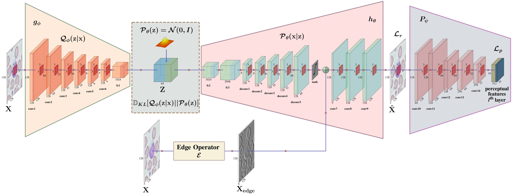
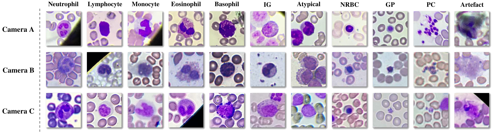

# WBC-Classification-UDA
Peripheral Blood Smear White Blood Cells Classification using Unsupervised Domain Adaptation (No target images used during training unlike SOTA UDA).

- tensorflow = 1.14.0
- python = 3.6 or higher
- keras = 2.2.5
- Nvidia cuda = 10.1

Train a Variational Auto-Encoder using Source domain (code in the file TrainVAE.py)

Perform Unsupervised Domain Adaptation on the Target domain (code in the file Latent_Search.py)
